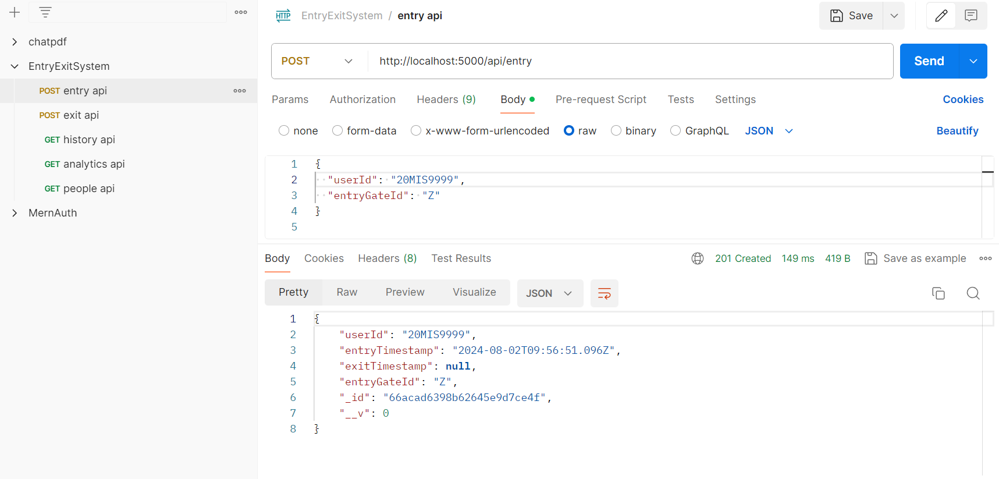
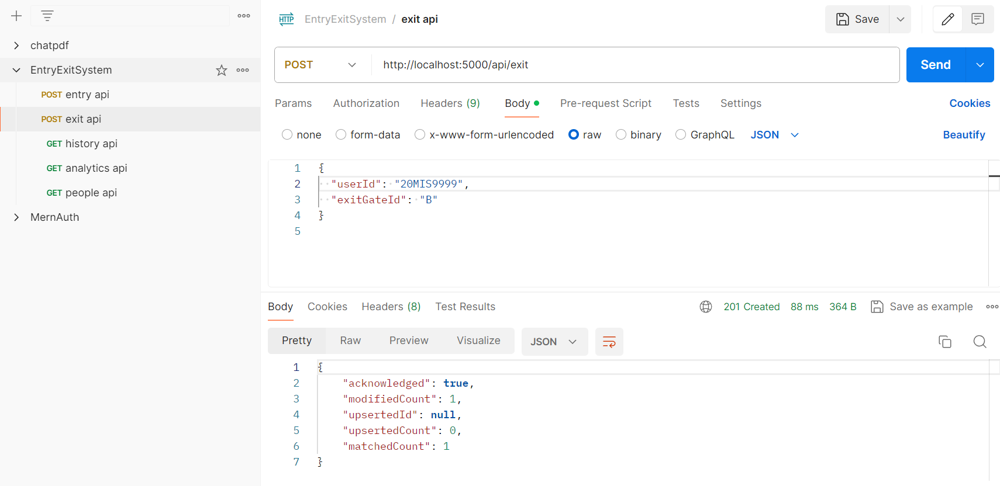
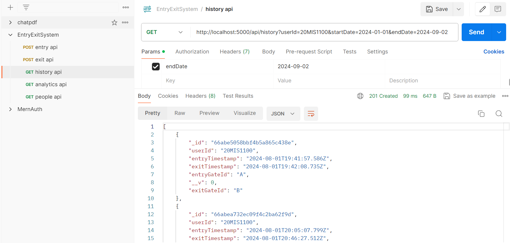
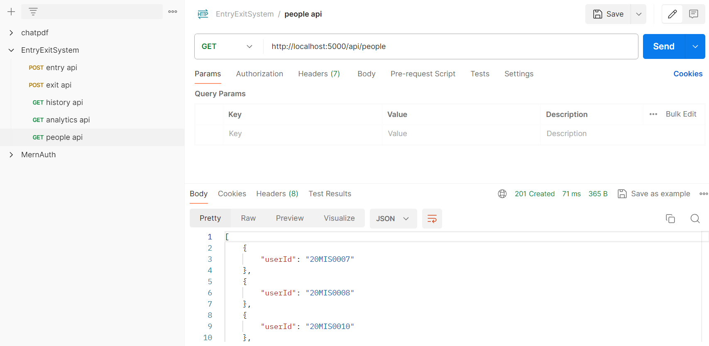
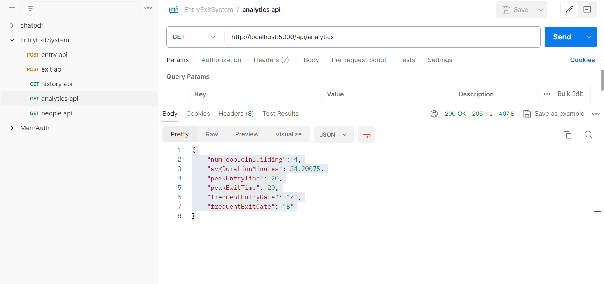

# Building Entry System

## Hosted On Vercel 
https://building-entry-system-client.vercel.app/

## Overview

The Building Entry System is a comprehensive solution for tracking people entering and leaving a building. Developed using Node.js, TypeScript, Express.js, and MongoDB, this application manages entry and exit events, provides historical records, and delivers insightful analytics.

## Logical Details

- **Entry/Exit Logic**: Ensured that the application enforces strict entry and exit rules:
  - **No Duplicate Exits**: A user cannot exit the building more than once without first registering an entry. If a user attempts to exit without an existing entry, an error is thrown.
  - **Unregistered Entries**: Prevents users from exiting if there is no registered entry for that user. An error is thrown if an exit is attempted without a corresponding entry.
  - **Real-Time Updates**: The system updates the records in real-time, ensuring accurate tracking of users inside the building.

## Features

1. **Entry and Exit Management**:
   - **Register Entry**: API to record when a person enters the building. Each entry includes a unique person identifier and the entry gate used.
   - **Register Exit**: API to record when a person exits the building. Each exit includes a unique person identifier and the exit gate used.

2. **API Endpoints**:
   - **POST /entry**: Register a person's entry into the building. Request body: `{ "userId": "string", "entryGateId": "string" }`.
   - **POST /exit**: Register a person's exit from the building. Request body: `{ "userId": "string", "exitGateId": "string" }`.
   - **GET /people**: Retrieve a list of people currently inside the building.
   - **GET /history**: Retrieve the entry and exit history of a specific person for a given date range.
   - **GET /analytics**: Access detailed analytics, including:
     - Number of people currently in the building
     - Average duration of stay
     - Peak entry and exit times
     - Most frequently used entry and exit gates

## Postman screenshots

3. **Minimalist UI**:
   - Developed using ReactJS, the UI allows users to perform entry and exit operations and view analytics in a straightforward interface.

4. **Testing**:
   - **Unit Tests**: Ensured individual components and services function correctly.
   - **Integration Tests**: Verified the integration of components and services to ensure the system works as expected.

## Key Accomplishments

- **Implemented Robust APIs**: Developed endpoints for managing entries and exits, retrieving current occupants, and analyzing data.
- **Designed User Interface**: Created a minimalist ReactJS frontend for easy management of entry and exit operations and viewing analytics.
- **Added Testing**: Included unit and integration tests to verify the reliability and correctness of the backend services.
- **Provided Analytics**: Delivered insights into building occupancy, average stay durations, peak usage times, and frequently used gates.

## Deployment

The application has been deployed to Vercel and is accessible at [[deployment URL](https://building-entry-system-client.vercel.app/)]. 

## How to Access

- **Deployment URL**: [Your Deployment URL]
- **GitHub Repository**: [Your GitHub Repository URL]

## Contact

For any questions or further information, please contact [sivalog25@gmail.com](mailto:sivalog25@gmail.com).

---

Thank you for reviewing my application. I look forward to your feedback!

